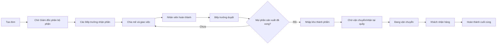
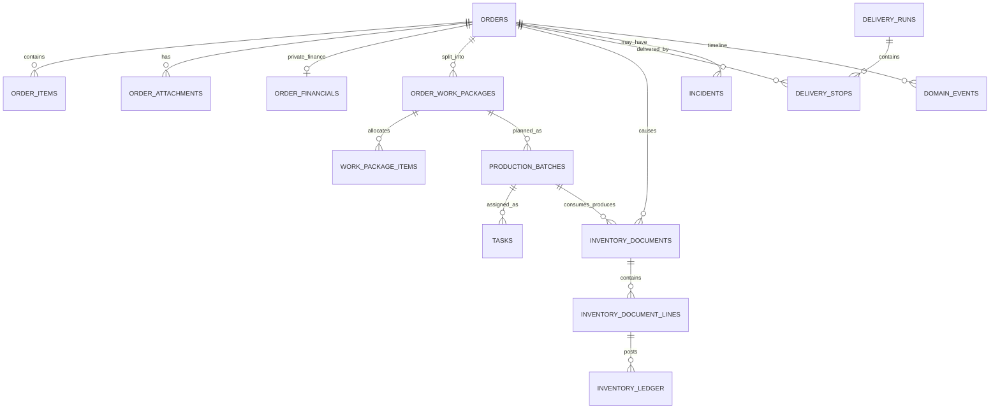

# SUMI APP — Đặc tả nghiệp vụ và mô hình dữ liệu chính thức

**Phiên bản:** 1.0  
**Ngày:** 22/08/2026  
**Trạng thái:** Baseline để thiết kế, triển khai và kiểm thử  
**Đối tượng đọc:** Chủ dự án, Giám đốc Kinh doanh, quản lý bộ phận, lập trình viên, kiểm thử viên và người phụ trách chuyển đổi dữ liệu.

---

## 1. Mục tiêu

SUMI APP là hệ thống vận hành xuyên suốt từ lúc tạo đơn đến khi khách nhận hàng. Hệ thống phải trả lời được tại mọi thời điểm:

- Đơn đang ở đâu và đang thuộc trách nhiệm của ai?
- Một đơn gồm những phần sản xuất nào, tại bếp/xưởng nào?
- Ai tạo, ai phân, ai nhận, ai thực hiện và ai duyệt từng phần?
- Nguyên liệu đã xuất từ kho nào, thành phẩm đã nhập kho nào?
- Đơn đã sẵn sàng giao chưa, ai đang giao, mất bao lâu và bao nhiêu km?
- Có sự cố gì, nguyên nhân gì, ai xử lý và xử lý ra sao?
- Người đang xem có được phép thấy dữ liệu này hay không?

Hệ thống ưu tiên điện thoại, thao tác ít chữ, nút lớn, hỗ trợ giọng nói, chụp ảnh và mạng yếu.

## 2. Phạm vi phiên bản 1

### Trong phạm vi

- Đăng nhập bằng số điện thoại nội bộ hoặc email và mật khẩu.
- Tổ chức nhân sự theo cơ sở, bộ phận, chức vụ và quyền bổ sung.
- Tạo bốn loại đơn: Bánh kem, Bánh mặn/ngọt, Teabreak và Macaron.
- Một đơn có nhiều phần sản xuất tại nhiều bếp/xưởng.
- Giám đốc phân phần đơn cho bộ phận; Bếp trưởng nhận và giao việc.
- Nhân viên hoàn thành phần việc bằng ảnh/giọng nói.
- Xuất, nhận và điều chuyển NVL liên kho.
- Nhập kho thành phẩm sau khi phần sản xuất được duyệt.
- Vận tải nhận đơn sẵn sàng, giao hàng, ghi thời gian và quãng đường.
- Thông báo có liên kết đến đơn/việc/sự cố.
- Sửa, huỷ, xoá có kiểm soát và lịch sử.
- KPI nhân viên và tổng quan Giám đốc.
- Bảo mật đặc biệt cho đơn Trường học Xưởng 42.
- Hoạt động ngoại tuyến có kiểm soát.

### Ngoài phạm vi ban đầu

- Tối ưu tuyến giao bằng thuật toán tự động.
- Tự động định giá bằng AI.
- Tự động phân bếp không cần Giám đốc.
- OTP SMS trả phí.
- Thay thế hoàn toàn phần mềm kế toán chuyên dụng.

## 3. Nguyên tắc bất biến

1. **Một mã đơn xuyên suốt:** Không tạo đơn con độc lập để đại diện cho từng bếp. Các bếp là các phần thực hiện của cùng một đơn.
2. **Quyền tối thiểu:** Người dùng chỉ tải dữ liệu cần cho công việc của họ.
3. **Giá tách khỏi vận hành:** Giá, cọc và thanh toán không được gửi đến giao diện Bếp, Kho, Vận tải hoặc nhân viên.
4. **Đơn Trường học là dữ liệu mật:** Chỉ Giám đốc Kinh doanh và Bếp trưởng Xưởng 42 được phân công được tải hồ sơ vận hành của đơn.
5. **Không cập nhật kho bằng thao tác rời:** Mọi thay đổi tồn kho phải đi qua giao dịch kho có chứng từ và yêu cầu Giám đốc duyệt.
6. **Không xoá dấu vết:** Các thay đổi nghiệp vụ phải có lịch sử trước/sau, người thực hiện và thời gian.
7. **Hoàn thành sản xuất khác hoàn thành đơn:** Sản xuất xong nghĩa là nhập kho và sẵn sàng giao; đơn chỉ hoàn thành cuối cùng khi khách đã nhận hoặc nhận tại quầy.
8. **Kiêm nhiệm không đổi chức vụ gốc:** Quyền kiêm nhiệm có phạm vi, thời hạn và người duyệt.
9. **Giá trị từ máy chủ:** Quyền, trạng thái, tồn kho, KPI và dữ liệu nhạy cảm không được tin vào giá trị do trình duyệt tự gửi.

## 4. Cơ cấu tổ chức

### Cấp quản lý

- Giám đốc Kinh doanh.
- Quản lý/Bếp trưởng từng khu vực.
- Bếp phó.
- Trưởng kho.
- Đội trưởng/Đội phó vận tải.

### Đơn vị vận hành

- Bakery:
  - Bếp nóng.
  - Bếp lạnh.
  - Kho nguyên liệu.
  - Kho thành phẩm/cửa hàng trưng bày.
- Xưởng 42 — Trường học:
  - Kho NVL trung tâm.
  - Bếp sản xuất.
  - Bếp trưởng, Bếp phó, thợ bánh.
- Xưởng 41 — Macaron:
  - Kho NVL.
  - Kho thành phẩm.
  - Bếp sản xuất.
- Vận tải:
  - Đội trưởng.
  - Đội phó.
  - Nhân viên giao hàng.
- Kế toán.

Mỗi tài khoản phải gắn với ít nhất một `organization_unit`, một chức vụ chính và danh sách quyền có hiệu lực.

## 5. Vai trò và phạm vi

| Vai trò | Phạm vi mặc định |
|---|---|
| Giám đốc Kinh doanh | Xem toàn hệ thống; phân đơn; cấp quyền; duyệt nghiệp vụ; xem/nhập giá nếu cần |
| Thu ngân/Bán hàng | Tạo đơn; xem đơn do mình tạo; yêu cầu sửa/huỷ; không phân bếp |
| Bếp trưởng | Xem phần đơn được phân cho bếp; nhận phần; chia mẻ; giao việc; yêu cầu NVL; duyệt sản xuất |
| Bếp phó | Thực hiện/điều phối phần việc được giao; thay Bếp trưởng khi có uỷ quyền |
| Thợ làm bánh | Chỉ xem và hoàn thành việc được giao |
| Trưởng kho | Tạo/xác nhận phiếu nhập, xuất, chuyển kho trong phạm vi kho được giao |
| Đội trưởng vận tải | Nhận danh sách sẵn sàng giao; chia tuyến và tài xế; duyệt người giao hộ |
| Nhân viên giao hàng | Chỉ xem chuyến được giao; nhận hàng; cập nhật hành trình; bàn giao |
| Kế toán | Xem dữ liệu tài chính được cấp; đối soát; không mặc nhiên xem đơn Trường học |

### Quyền bổ sung và kiêm nhiệm

Quyền bổ sung phải có:

- Người cấp.
- Người nhận.
- Quyền cụ thể.
- Đơn/cơ sở/bộ phận/kho áp dụng.
- Thời gian bắt đầu và kết thúc.
- Lý do.
- Trạng thái: chờ duyệt, có hiệu lực, hết hạn, thu hồi.

Ví dụ: Bếp phó được duyệt giao hộ đúng đơn `DH-0264`; quyền đó không cho phép xem mọi đơn vận tải.

## 6. Luồng đơn hàng tổng quát

### Trạng thái cấp đơn

| Mã | Nhãn | Điều kiện vào | Bước tiếp theo |
|---|---|---|---|
| `draft` | Nháp | Chưa gửi | Gửi đơn hoặc xoá nháp |
| `awaiting_assignment` | Chờ phân bộ phận | Đơn hợp lệ đã gửi | Giám đốc tạo các phần đơn |
| `awaiting_acceptance` | Chờ Bếp trưởng nhận | Đã có ít nhất một phần được phân | Các Bếp trưởng nhận phần |
| `in_production` | Đang sản xuất | Có phần đã nhận/đang làm | Hoàn thành từng phần |
| `awaiting_production_approval` | Chờ duyệt sản xuất | Nhân viên báo xong | Bếp trưởng duyệt/làm lại |
| `ready_for_fulfillment` | Chờ vận chuyển/nhận | Tất cả phần bắt buộc đã duyệt và nhập kho | Tài xế nhận hoặc quầy giao |
| `in_delivery` | Đang vận chuyển | Đã xuất kho cho chuyến giao | Bàn giao khách |
| `completed` | Hoàn thành | Có bằng chứng khách nhận | Kết thúc |
| `cancelled` | Đã huỷ | Huỷ có lý do và xử lý phần dở dang | Kết thúc |

Không dùng một cột trạng thái duy nhất để thay thế trạng thái chi tiết của từng phần sản xuất, nhiệm vụ, phiếu kho và chuyến giao.

## 7. Tạo đơn theo loại

### Trường chung

- Người tạo và thời điểm tạo — máy chủ tự ghi.
- Khách hàng, số điện thoại.
- Ảnh mẫu khách gửi.
- Giao tận nơi hoặc nhận tại quầy.
- Địa chỉ, thời hạn cần hàng.
- Ghi chú vận hành.
- Loại đơn.

### Bánh kem

- Dòng/vị bánh.
- Số lượng, kích thước.
- Nội dung viết trên bánh.
- Màu/trang trí.
- Nến và phụ kiện.

### Bánh mặn/ngọt

- Danh sách sản phẩm.
- Số lượng từng loại.
- Quy cách đóng gói, nhãn và khay.

### Teabreak

- Số khách.
- Danh sách món mặn, ngọt và đồ uống.
- Địa điểm/sự kiện.
- Setup, dụng cụ và nhân sự phục vụ.
- Thời gian có mặt và thời gian bắt đầu.

### Macaron

- Sỉ/lẻ.
- Số lượng theo màu/vị.
- Quy cách hộp.
- Logo/in ấn.

Người tạo không chọn bếp. Sau khi tạo, đơn vào `awaiting_assignment`.

### Bản sao gửi khách

Cho phép sao chép bản xác nhận gồm mã đơn, thông tin khách, sản phẩm, quy cách, thời gian/địa chỉ và thông tin thanh toán nếu Giám đốc đã nhập. Không chứa bộ phận, nhân sự, kho, KPI hoặc ghi chú nội bộ.

## 8. Một đơn nhiều bếp

Giám đốc tạo một hoặc nhiều `order_work_packages` từ cùng một đơn. Mỗi phần có:

- Bộ phận/bếp đích.
- Các dòng hàng và số lượng thuộc phần đó.
- Thời hạn nội bộ.
- Bếp trưởng được phép nhận.
- Trạng thái riêng.
- Phụ thuộc với phần khác nếu có.

Ví dụ đơn gồm 20 bánh su và 2 bánh kem:

- Phần A → Bakery/Bếp nóng → 20 bánh su.
- Phần B → Bakery/Bếp lạnh → 2 bánh kem.

Kho thành phẩm và Vận tải chỉ nhận tín hiệu sẵn sàng khi A và B đều được duyệt. Giao trước một phần là ngoại lệ và chỉ được thực hiện sau khi Giám đốc phê duyệt rõ phần hàng, số lượng và chuyến giao.

## 9. Giao việc sản xuất

Bếp trưởng nhận phần đơn, chia thành một hoặc nhiều mẻ và tạo nhiệm vụ:

- Người chịu trách nhiệm.
- Người hỗ trợ.
- Sản phẩm/số lượng/quy cách.
- Thời hạn.
- Ảnh mẫu và hướng dẫn.
- Yêu cầu ảnh hoàn thành.
- Trạng thái và thời gian bắt đầu/kết thúc.

Nhân viên không được tự đánh dấu phần đơn hoàn thành. Họ chỉ hoàn thành nhiệm vụ. Khi mọi nhiệm vụ bắt buộc xong, phần đơn chuyển sang chờ Bếp trưởng duyệt.

Bếp trưởng không từ chối trực tiếp phần đơn được phân. Nếu không đủ năng lực, nguyên liệu hoặc thời gian, Bếp trưởng bấm **Yêu cầu Giám đốc phân lại**, ghi lý do và ảnh/tài liệu nếu có. Phần đơn giữ trạng thái chờ xử lý cho đến khi Giám đốc quyết định.

## 10. Kho nguyên liệu và thành phẩm

### Mô hình giao dịch

Mọi biến động kho dùng chứng từ `inventory_documents` và các dòng `inventory_document_lines`.

| Loại | Kho đi | Kho đến | Khi hoàn tất |
|---|---|---|---|
| Nhập mua | Nhà cung cấp | Kho NVL | Kho nhận xác nhận |
| Xuất sản xuất | Kho NVL | Mẻ sản xuất | Người nhận NVL xác nhận |
| Chuyển liên kho | Một kho SUMI | Kho SUMI khác | Cả hai đầu xác nhận |
| Nhập thành phẩm | Mẻ/phần sản xuất | Kho thành phẩm | Bếp trưởng duyệt sản xuất |
| Xuất giao hàng | Kho thành phẩm | Chuyến giao | Tài xế nhận hàng |
| Hàng trả lại | Chuyến giao/cửa hàng | Kho phù hợp | Kiểm tra chất lượng |
| Điều chỉnh | Kho | Kho | Có phê duyệt và lý do |

Xưởng 42 là kho NVL lớn nhất nhưng điều chuyển phải hỗ trợ hai chiều giữa mọi kho được phép. Mọi đề nghị chuyển/xuất NVL có nút **Yêu cầu Giám đốc duyệt**; chỉ được xuất thực tế sau khi được duyệt.

### Kho thành phẩm mặc định

- Bakery/Bếp lạnh và Bakery/Bếp nóng → Kho thành phẩm Bakery; phục vụ hàng trưng bày tại hai cửa hàng.
- Xưởng 41/Macaron → Kho Macaron Xưởng 41; theo dõi đầy đủ xuất, nhập và tồn.
- Xưởng 42/Trường học → Kho mù: thành phẩm đi thẳng đến điểm trường, không hiển thị tồn thành phẩm thông thường.
- Một số sản phẩm từ Xưởng 42 dùng trưng bày, ví dụ Trung Thu và bánh pía → Kho thành phẩm Bakery theo quyết định/phân bổ của Giám đốc.

### Giao dịch hoàn thành sản xuất

Một hàm máy chủ duy nhất phải:

1. Khoá phần đơn/mẻ cần duyệt.
2. Kiểm tra nhiệm vụ bắt buộc và ảnh minh chứng.
3. Ghi phê duyệt của Bếp trưởng.
4. Ghi tiêu hao/thừa NVL.
5. Tạo phiếu nhập kho thành phẩm.
6. Cập nhật trạng thái phần đơn.
7. Nếu mọi phần xong, cập nhật đơn thành `ready_for_fulfillment`.
8. Tạo thông báo cho Kho và Vận tải.

Toàn bộ thành công hoặc toàn bộ hoàn tác.

## 11. Vận tải

- Vận tải chỉ thấy đơn đã sẵn sàng hoặc được giao trước theo kế hoạch có quyền.
- Đội trưởng phân tài xế/chuyến.
- Người ngoài Vận tải chỉ được giao hộ khi có uỷ quyền theo đơn.
- Khi nhận hàng: ghi người nhận, thời gian, ảnh, vị trí và phiếu xuất kho.
- Khi giao: ghi thời gian, vị trí, ảnh/phiếu ký và người nhận.
- Quãng đường lấy từ hành trình GPS hoặc số km hợp lệ; phải ghi nguồn đo.
- Khoảng cách chuẩn dùng để đánh giá/chốt tuyến Trường học được tính từ định vị Xưởng 42 đến địa chỉ khách hàng đã chuẩn hoá. Nếu GPS hành trình khả dụng, lưu thêm quãng đường thực tế để đối chiếu nhưng không ghi đè nguồn tính chuẩn.
- Hoàn thành giao phát âm thanh xác nhận ở thiết bị thao tác.

## 12. Sửa, huỷ và xoá

### Sửa

- Nháp: người tạo sửa.
- Chưa có Bếp trưởng nhận: người có quyền sửa; ghi lịch sử.
- Đã nhận/đang làm: tạo yêu cầu thay đổi; thông báo mọi bộ phận bị ảnh hưởng; Bếp trưởng xác nhận lại.
- Đã nhập kho/xuất giao: không sửa trực tiếp số lượng/quy cách; dùng chứng từ điều chỉnh.
- Hoàn thành: chỉ bổ sung ghi chú/hồ sơ, không sửa lịch sử gốc.

Người có quyền tạo/sửa trực tiếp được sửa đơn trong vòng 30 phút kể từ lúc tạo, với điều kiện đơn chưa bước vào sản xuất. Sau 30 phút hoặc khi đã có bộ phận nhận, bắt buộc gửi **Yêu cầu sửa đơn** cho Giám đốc duyệt.

### Huỷ

- Không xoá bản ghi.
- Bắt buộc lý do, người xác nhận và cách xử lý NVL/thành phẩm dở dang.
- Huỷ các nhiệm vụ/chuyến chưa bắt đầu và tạo chứng từ hoàn kho nếu cần.

### Xoá hẳn

- Chỉ dành cho dữ liệu thử nghiệm/nhập nhầm chưa phát sinh giao dịch.
- Chỉ Giám đốc/Owner.
- Lưu snapshot vào audit log trước khi xoá.
- Từ chối xoá nếu đã có nhiệm vụ bắt đầu, phiếu kho, sự cố hoặc chuyến giao.

## 13. Sự cố và cách xử lý

Sự cố gắn với đơn, phần đơn, nhiệm vụ, phiếu kho hoặc chuyến giao. Trường bắt buộc:

- Loại sự cố.
- Người báo, thời gian, vị trí nếu cần.
- Mô tả bằng chữ/giọng nói.
- Ảnh minh chứng.
- Mức độ.
- Nguyên nhân sau xác minh.
- Người xử lý, hành động xử lý.
- Kết quả và thời gian đóng.
- Ảnh hưởng đến thời hạn/KPI.

Các nguyên nhân do khách thay đổi, thiết bị, thiếu NVL hoặc điều phối phải được phân biệt để KPI không phạt sai người.

## 14. Thông báo

### Sự kiện tối thiểu

- Có đơn mới: Giám đốc nghe giọng Việt “CÓ ĐƠN MỚI”.
- Đơn được phân: Bếp trưởng liên quan.
- Bếp trưởng nhận/giao việc: nhân viên liên quan.
- Nhiệm vụ hoàn thành: Bếp trưởng.
- Phần sản xuất được duyệt/từ chối: người thực hiện.
- Đơn sẵn sàng giao: Kho và Vận tải.
- Chuyến được phân: tài xế.
- Giao hoàn tất: âm thanh xác nhận kiểu máy tính tiền.
- Sự cố/thay đổi khác: âm “ting ting”.

Mỗi thông báo có `entity_type`, `entity_id`, `recipient_id/role/unit`, trạng thái đọc, mức độ và deep link. Máy chủ tạo thông báo một lần; thiết bị chỉ hiển thị, không tự phát broadcast cho cả hệ thống.

## 15. Bảo mật giá và đơn Trường học

### Giá

- Lưu ở bảng riêng `order_financials`.
- Chỉ API có quyền tài chính được select bảng này.
- Giá là tuỳ chọn; Giám đốc quyết định nhập hoặc để trống.
- Không nhúng giá vào `orders`, `order_items`, notification payload, offline cache hoặc ảnh/tên file.
- Bản sao gửi khách chỉ có giá khi người có quyền chủ động chọn đưa vào.

### Trường học Xưởng 42

- Đánh dấu `confidentiality = school_restricted`.
- Chỉ Giám đốc Kinh doanh và Bếp trưởng Xưởng 42 được phân công được select hồ sơ đơn.
- Nhân viên nhận nhiệm vụ đã tối giản, không kèm tên trường/giá/thông tin thương mại nếu không cần.
- Giá và thanh toán đơn Trường học không quản lý trong SUMI APP ở phiên bản này; xử lý thủ công ngoài ứng dụng. Không tạo `order_financials` cho đơn Trường học.
- Log mọi lần xem, xuất, sao chép hoặc tải ảnh.
- Ảnh dùng bucket riêng tư và URL ký ngắn hạn.

### Lưu trữ ảnh

- Ảnh mẫu, ảnh sản xuất và ảnh giao hàng lưu trực tuyến trong ứng dụng tối đa 7 ngày.
- Trước khi hết hạn, tiến trình máy chủ sao lưu sang Google Drive theo cấu trúc năm/tháng/ngày/mã đơn.
- Chỉ xoá bản trong storage ứng dụng sau khi Drive trả về thành công, checksum khớp và đã ghi `backup_status = verified`.
- Nếu backup thất bại, giữ ảnh và phát cảnh báo cho quản trị; không tự xoá.
- Quyền thư mục Drive phải tương đương hoặc chặt hơn quyền trong ứng dụng, đặc biệt với đơn Trường học.
- Timeline vẫn giữ metadata, checksum và tham chiếu bản backup sau khi file nóng được dọn.

## 16. KPI

### Nhân viên

- Việc làm hằng ngày.
- Việc được giao.
- Số nhiệm vụ/công việc hoàn thành.
- Tỷ lệ đúng hạn.
- Thời gian làm việc và thời gian tăng ca.
- Số lượng bánh hoàn thành và sản lượng theo loại công việc.
- Số lần làm lại có phân loại nguyên nhân.
- Vận tải: số chuyến, km, thời gian giao, đúng hạn.

### Quản lý

- Doanh thu/chi theo thời gian — chỉ vai trò tài chính phù hợp.
- Tổng đơn, đang làm, chờ vận chuyển, đang vận chuyển, hoàn thành, huỷ.
- Năng lực theo bộ phận.
- Sự cố mở và đơn có nguy cơ trễ.

KPI lấy từ event/timeline đã xác thực, không cho nhập tay kết quả cuối. Kiêm nhiệm được gắn `performed_as_role` để tính đúng nhóm công việc.

Các lý do được loại trừ khỏi đánh giá trễ/không hoàn thành gồm: thiên tai, chính sách/quyết định của Nhà nước, kẹt xe được ghi nhận, đau ốm hoặc bệnh tật. Mỗi trường hợp phải có sự cố/yêu cầu, bằng chứng phù hợp và người quản lý duyệt; không loại trừ chỉ bằng ghi chú tự khai.

## 17. Mô hình dữ liệu đề xuất

### 17.1 Tổ chức và quyền

#### `organization_units`

- `id uuid PK`
- `code text UNIQUE NOT NULL`
- `name text NOT NULL`
- `unit_type text` — company, branch, kitchen, warehouse, transport, accounting
- `parent_id uuid FK organization_units`
- `active boolean`
- `metadata jsonb`

#### `profile_assignments`

- `id uuid PK`
- `profile_id uuid FK profiles`
- `unit_id uuid FK organization_units`
- `position_code text`
- `is_primary boolean`
- `valid_from timestamptz`
- `valid_to timestamptz nullable`
- `approved_by uuid FK profiles`

#### `permission_grants`

- `id uuid PK`
- `profile_id uuid`
- `permission_code text`
- `scope_type text` — global, unit, order, kitchen, warehouse, task
- `scope_id uuid nullable`
- `valid_from`, `valid_to`
- `reason text`
- `granted_by uuid`
- `revoked_at`, `revoked_by`

Ràng buộc: chỉ một chức vụ chính có hiệu lực tại một thời điểm; grant hết hạn không được dùng.

### 17.2 Đơn và khách hàng

#### `orders` — mở rộng bảng hiện có

- `id uuid PK`
- `order_code text UNIQUE NOT NULL`
- `order_type text` — cake, bakery, teabreak, macaron, school
- `customer_id uuid FK customers`
- `created_by uuid FK profiles nullable`
- `created_by_name_snapshot text`
- `created_at timestamptz`
- `required_at timestamptz`
- `fulfillment_method text` — delivery, pickup
- `delivery_address text`
- `status text`
- `confidentiality text default 'normal'`
- `allow_partial_fulfillment boolean NOT NULL default false`
- `partial_fulfillment_approved_by uuid nullable`
- `partial_fulfillment_approved_at timestamptz nullable`
- `operational_note text`
- `cancelled_at`, `cancelled_by`, `cancel_reason`
- `completed_at`
- `version integer NOT NULL default 1`

Không lưu giá tại đây.

#### `order_items` — kế thừa và chuẩn hoá

- `id`, `order_id`
- `product_id nullable`
- `name_snapshot`
- `quantity numeric`
- `unit text`
- `specification jsonb` — schema theo loại đơn
- `display_order integer`

`specification` phải được validate phía máy chủ theo `order_type`; không nhận JSON tuỳ ý không kiểm soát.

#### `order_attachments`

- `id`, `order_id`
- `attachment_type` — customer_sample, production_proof, warehouse_proof, delivery_proof, signed_document
- `storage_path`
- `mime_type`, `size_bytes`, `checksum`
- `created_by`, `created_at`
- `visibility_scope`
- `gps_lat`, `gps_lng nullable`
- `hot_storage_expires_at timestamptz`
- `backup_status text` — pending, processing, verified, failed
- `drive_file_id text nullable`
- `backup_checksum text nullable`
- `backed_up_at timestamptz nullable`

#### `order_financials`

- `order_id uuid PK FK orders`
- `total_amount numeric nullable`
- `deposit_amount numeric nullable`
- `payment_method text nullable`
- `payment_status text nullable`
- `entered_by`, `entered_at`, `updated_by`, `updated_at`

RLS không cho vai trò vận hành select bảng này.

### 17.3 Phân bộ phận và sản xuất

#### `order_work_packages`

- `id uuid PK`
- `order_id uuid FK orders`
- `unit_id uuid FK organization_units`
- `assigned_by uuid`
- `assigned_at timestamptz`
- `accepted_by uuid nullable`
- `accepted_at timestamptz nullable`
- `status text` — assigned, accepted, in_progress, awaiting_approval, completed, rejected, cancelled
- `due_at timestamptz`
- `completed_at timestamptz`
- `approved_by`, `approved_at`
- `rejection_reason`
- `reassignment_requested_at timestamptz nullable`
- `reassignment_requested_by uuid nullable`
- `reassignment_reason text nullable`
- `version integer`

#### `work_package_items`

- `work_package_id`
- `order_item_id`
- `quantity numeric`
- PK `(work_package_id, order_item_id)`

Tổng số lượng phân qua các work package không được vượt quá số lượng order item, trừ khi có cờ sản xuất dư được phê duyệt.

#### `production_batches`

- `id`, `work_package_id`, `batch_code`
- `planned_quantity`, `actual_quantity`, `waste_quantity`
- `status`
- `started_at`, `completed_at`
- `created_by`
- `bom_version_id nullable`

#### `tasks` — mở rộng bảng hiện có

- `work_package_id nullable`
- `production_batch_id nullable`
- `assigned_to uuid`
- `assigned_by uuid`
- `performed_as_role text`
- `task_type text`
- `required_proof_types text[]`
- `started_at`, `completed_at`
- `status`
- `completion_note`
- `version integer`

### 17.4 Kho

#### `warehouses`

- `id`, `code UNIQUE`, `name`
- `unit_id`
- `warehouse_type` — ingredient, finished_goods, display, blind_dispatch
- `active`

#### `inventory_items`

- `id`, `sku UNIQUE`, `name`, `item_type`
- `base_unit`
- `lot_tracking boolean`
- `expiry_tracking boolean`

#### `inventory_documents`

- `id`, `document_code UNIQUE`
- `document_type`
- `source_warehouse_id nullable`
- `destination_warehouse_id nullable`
- `order_id`, `work_package_id`, `production_batch_id nullable`
- `status` — draft, awaiting_issue, in_transit, awaiting_receipt, completed, disputed, cancelled
- `created_by`, `approved_by`, `issued_by`, `received_by`
- `approval_status` — pending, approved, rejected
- `created_at`, `issued_at`, `received_at`
- `reason`, `discrepancy_note`
- `idempotency_key text UNIQUE`

#### `inventory_document_lines`

- `id`, `document_id`, `inventory_item_id`
- `planned_quantity`
- `issued_quantity`
- `received_quantity`
- `unit`
- `lot_code`, `expiry_date nullable`

#### `inventory_ledger`

- `id bigserial PK`
- `warehouse_id`, `inventory_item_id`
- `document_line_id`
- `quantity_delta numeric`
- `occurred_at`
- `balance_after nullable`

Ledger chỉ append, không update/xoá.

### 17.5 Vận tải

#### `delivery_runs`

- `id`, `run_code`
- `assigned_driver_id`
- `assigned_by`
- `status` — planned, accepted, loading, in_transit, completed, cancelled
- `started_at`, `completed_at`
- `start_lat/lng`, `end_lat/lng`
- `distance_km`, `distance_source`
- `planned_origin_lat`, `planned_origin_lng`
- `planned_destination_lat`, `planned_destination_lng`
- `planned_distance_km`

#### `delivery_stops`

- `id`, `delivery_run_id`, `order_id`
- `sequence_no`
- `status`
- `arrived_at`, `delivered_at`
- `recipient_name`
- `proof_attachment_id`
- `failure_reason`

#### `delivery_delegations`

- `id`, `order_id`, `delegate_profile_id`
- `requested_by`, `approved_by`
- `valid_from`, `valid_to`
- `reason`, `status`

### 17.6 Sự cố, thông báo và lịch sử

#### `incidents`

- `id`, `incident_code`
- `entity_type`, `entity_id`
- `category`, `severity`, `status`
- `reported_by`, `reported_at`
- `description`, `cause`, `resolution`
- `resolved_by`, `resolved_at`
- `kpi_exclusion_reason nullable`

#### `notifications`

- `id`, `event_key UNIQUE`
- `recipient_profile_id nullable`
- `recipient_unit_id nullable`
- `recipient_role nullable`
- `notification_type`, `severity`
- `title`, `body`
- `entity_type`, `entity_id`
- `deep_link`
- `created_at`, `read_at`

#### `domain_events`

- `id bigserial`
- `event_type`
- `entity_type`, `entity_id`
- `actor_id`, `actor_role`, `actor_unit_id`
- `occurred_at`
- `payload jsonb` — không chứa giá với event vận hành
- `correlation_id uuid`
- `idempotency_key text UNIQUE`

#### `audit_log` — kế thừa

Bổ sung `before_data`, `after_data`, `reason`, `ip`, `user_agent`, `correlation_id`; dữ liệu chỉ append.

## 18. Quan hệ dữ liệu chính

## 19. API/RPC bắt buộc

Các thao tác quan trọng phải chạy phía máy chủ:

- `create_order(payload, idempotency_key)`
- `assign_order_work_packages(order_id, packages)` — Giám đốc.
- `accept_work_package(package_id)` — đúng Bếp trưởng.
- `assign_production_tasks(package_id, tasks)` — Bếp trưởng.
- `complete_task(task_id, proof_ids, note, idempotency_key)`
- `approve_production_package(package_id, actuals, proof_ids, idempotency_key)`
- `request_work_package_reassignment(package_id, reason, attachment_ids)`
- `approve_partial_fulfillment(order_id, package_ids, reason)` — Giám đốc.
- `request_inventory_transfer(...)`
- `approve_inventory_document(document_id)` — Giám đốc.
- `issue_inventory_document(document_id, ...)`
- `receive_inventory_document(document_id, received_lines, ...)`
- `assign_delivery_run(...)`
- `accept_delivery_run(run_id)`
- `complete_delivery_stop(stop_id, proof_id, gps, idempotency_key)`
- `request_order_change(order_id, changes, reason)`
- `approve_order_change(request_id)`
- `cancel_order(order_id, reason, disposition_plan)`
- `hard_delete_order(order_id, reason)` — chỉ khi đủ điều kiện.

Mỗi RPC kiểm tra quyền, phiên bản bản ghi và `idempotency_key` để chống bấm/gửi lại.

## 20. RLS và kiểm soát truy cập

- Deny by default cho mọi bảng nghiệp vụ mới.
- Không dùng role do client gửi; lấy từ session/profile/grant còn hiệu lực.
- `orders`: lọc theo quyền, đơn do người dùng tạo, work package được giao hoặc delivery stop được giao.
- `order_financials`: chỉ Giám đốc và quyền tài chính được chỉ định.
- Đơn `school_restricted`: thêm điều kiện Giám đốc hoặc Bếp trưởng Xưởng 42 đúng assignment.
- Attachments: bucket private; signed URL ngắn hạn sau khi kiểm tra cùng policy.
- Service-role key chỉ dùng server/Edge Function, không đưa vào frontend.
- Log các lần xem dữ liệu mật và xuất dữ liệu.

## 21. Ngoại tuyến và đồng bộ

- Mỗi thao tác có UUID `idempotency_key` tạo trên thiết bị.
- Hàng đợi lưu loại thao tác và payload tối thiểu, không cache giá hoặc đơn Trường học ngoài phạm vi.
- Hiển thị “đang chờ gửi”, “đã gửi”, “cần xử lý xung đột”.
- Server dùng optimistic locking qua `version`.
- Không xếp hàng ngoại tuyến cho thao tác xoá hẳn, cấp quyền, duyệt tài chính hoặc xem đơn mật mới.
- Ảnh được nén, checksum, tải trước; RPC chỉ nhận attachment đã tải thành công.

## 22. Kế hoạch chuyển đổi từ hệ thống hiện tại

### Giai đoạn 0 — An toàn

- Chụp backup database và storage.
- Đóng băng thay đổi schema production.
- Dựng staging từ bản sao dữ liệu thật đã ẩn dữ liệu nhạy cảm nếu cần.
- Không restore backup cũ đè production đang vận hành.

### Giai đoạn 1 — Migration tương thích ngược

- Thêm bảng mới, không xoá bảng/cột cũ.
- Tạo `organization_units`, ánh xạ `profiles.station/role/extra_roles`.
- Tạo work package mặc định cho đơn cũ dựa trên channel/station nếu suy luận chắc chắn.
- Đơn không xác định gắn `legacy_unassigned`, không đoán bếp.
- Chuyển log kho cũ sang inventory document/ledger với cờ `legacy_import`.
- Tách dữ liệu tiền từ `orders` sang `order_financials`; giữ cột cũ tạm thời trong giai đoạn dual-read.

### Giai đoạn 2 — Dual run

- Code mới ghi hệ thống mới và đối chiếu với bảng cũ.
- Báo cáo chênh lệch hàng ngày: trạng thái đơn, tồn kho, thành phẩm, doanh thu.
- Không cho tác vụ mới đọc trực tiếp giá từ `orders`.

### Giai đoạn 3 — Cutover

- Bật read-only ngắn hạn.
- Chạy backfill idempotent lần cuối.
- Đối chiếu tổng số đơn, đơn mở, tồn từng kho và phiếu đang chuyển.
- Chuyển frontend sang API mới.
- Theo dõi lỗi và có cờ quay lại chế độ đọc cũ; không rollback bằng cách xoá dữ liệu mới.

## 23. Kiểm thử bắt buộc

### Luồng chính

1. Tạo từng loại đơn và sao chép gửi khách.
2. Một đơn được phân cho hai bếp; chỉ hoàn tất sản xuất khi cả hai phần được duyệt.
3. Bếp trưởng nhận, giao hai nhân viên; mỗi người hoàn thành độc lập.
4. Duyệt sản xuất tạo đúng một phiếu nhập kho dù người dùng bấm hai lần.
5. Vận tải thấy đơn ngay sau khi nhập kho hoàn tất.
6. Giao hàng ghi thời gian, GPS, km và ảnh bàn giao.

### Quyền và bảo mật

7. Nhân viên không thể gọi API xem giá dù sửa request thủ công.
8. Vai trò không hợp lệ không thể biết đơn Trường học có tồn tại.
9. Bếp trưởng Xưởng 41 không xem đơn Trường học Xưởng 42.
10. URL ảnh hết hạn và không dùng được bởi tài khoản khác.
11. Quyền kiêm nhiệm hết hạn lập tức mất hiệu lực.

### Ngoại lệ

12. Hai Bếp trưởng nhận cùng một phần: chỉ một người thành công.
13. Hai thiết bị hoàn thành cùng nhiệm vụ: chỉ ghi một event.
14. Mất mạng khi tải ảnh/hoàn thành: không nhập kho hai lần.
15. Sửa đơn đang làm: các bếp liên quan phải xác nhận lại.
16. Huỷ đơn đang sản xuất: có kế hoạch xử lý NVL/thành phẩm dở dang.
17. Chênh lệch chuyển kho: không hoàn tất chứng từ cho đến khi xử lý.
18. Đơn nhiều bếp không mở giao hàng khi còn phần chưa xong, trừ khi có bản ghi Giám đốc duyệt giao một phần.
19. Bếp trưởng yêu cầu phân lại nhưng không thể tự sửa `unit_id` của work package.
20. Phiếu chuyển NVL không thể xuất khi chưa có Giám đốc duyệt.
21. Sau 30 phút, người tạo không thể sửa trực tiếp dù thay đổi request thủ công.
22. Ảnh chỉ bị dọn sau khi Google Drive backup đã xác minh checksum; backup lỗi phải giữ ảnh.
23. Tài khoản kiêm nhiệm tạo đơn mất nút và API quyền ngay khi grant hết hạn/thu hồi.

## 24. Tiêu chí nghiệm thu

- 100% đơn có timeline từ tạo đến kết thúc.
- 100% thay đổi tồn kho truy được về chứng từ.
- Không có giá trong payload/API của vai trò vận hành.
- Không có truy cập trái phép vào đơn Trường học trong kiểm thử bảo mật.
- Không nhập kho hoặc hoàn thành trùng khi gửi lại request.
- Danh sách đơn tải và thao tác được trên màn hình 360px.
- Nút chính tối thiểu 56px, hỗ trợ giảm chuyển động và trạng thái mất mạng.
- Thông báo mở đúng entity và không phát trùng.
- Báo cáo đối chiếu migration không có chênh lệch chưa giải thích.

## 25. Quyết định nghiệp vụ đã xác nhận ngày 22/08/2026

1. **Giá đơn Trường học:** Không đưa vào SUMI APP ở phiên bản này; xử lý thủ công ngoài ứng dụng để giảm rủi ro.
2. **Giao một phần:** Mặc định phải hoàn thành đủ mọi phần mới giao. Giám đốc có quyền duyệt giao trước một phần theo từng đơn.
3. **Bếp không thể nhận:** Bếp trưởng gửi yêu cầu để Giám đốc phân lại; không tự từ chối hoặc chuyển cho bếp khác.
4. **Điều chuyển NVL:** Có nút yêu cầu Giám đốc duyệt; chỉ xuất/chuyển sau khi được duyệt.
5. **Kho mặc định:** Bếp nóng/lạnh về Kho Bakery; Macaron về Kho Xưởng 41; Trường học Xưởng 42 dùng kho mù đi thẳng; Trung Thu/bánh pía trưng bày có thể về Kho Bakery.
6. **Ảnh:** Lưu nóng 7 ngày, sau đó chỉ dọn khi đã backup Google Drive và xác minh checksum thành công.
7. **Khoảng cách:** Chuẩn tính từ định vị Xưởng 42 đến địa chỉ khách hàng; lưu thêm GPS thực tế khi có.
8. **KPI:** Việc hằng ngày, việc được giao, thời gian làm/tăng ca, số bánh và công việc hoàn thành. Loại trừ có duyệt: thiên tai, chính sách Nhà nước, kẹt xe, đau ốm/bệnh tật.
9. **Sửa đơn:** Sửa trực tiếp tối đa 30 phút nếu chưa sản xuất; sau đó phải xin Giám đốc duyệt.
10. **Quyền tạo đơn bổ sung:** Chỉ xuất hiện khi Giám đốc cấp quyền kiêm nhiệm có phạm vi và thời hạn.

## 26. Thứ tự triển khai đề xuất

1. Chuyển 10 quyết định đã chốt thành migration, policy và acceptance test tương ứng.
2. Tạo migration cho tổ chức/quyền và bảng tài chính tách biệt.
3. Tạo work package, batch, task và state machine.
4. Tạo inventory document/ledger và RPC hoàn thành sản xuất.
5. Tạo delivery run/stop và RPC bàn giao.
6. Tạo notifications/domain events/audit.
7. Thiết lập RLS, storage policy và kiểm thử đơn Trường học.
8. Tích hợp giao diện mobile theo từng vai trò.
9. Backfill staging, kiểm thử nghiệm thu và diễn tập cutover.
10. Cutover production trong cửa sổ read-only có kiểm soát.

---

Tài liệu này là baseline. Mọi thay đổi nghiệp vụ sau khi chốt phải được ghi thành quyết định có ngày, người duyệt, phần bị ảnh hưởng và kế hoạch migration tương ứng.
